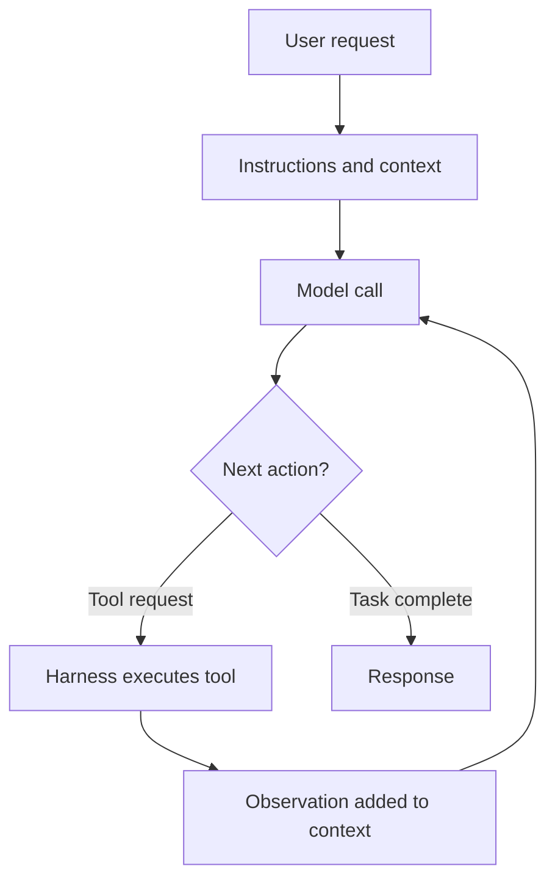

# Hermes Agent Harness: A Hands-on Self-study Guide

*Set up Hermes with LiteLLM, then learn how an agent harness works through practical exercises.*

## What you will learn

An LLM can generate an answer, but an agent needs a surrounding system to use tools, handle their results, remember useful information, and continue working over several steps. That surrounding system is the **agent harness**.

In this guide, you will install Hermes, connect it to your LiteLLM gateway, and explore these capabilities one at a time. You will work with instructions, tools, the agent loop, persistent memory, session recall, skills, delegation, scheduling, and logs.

## How to use this guide

Work through the setup in order. Once a plain model response works, complete the exercises at your own pace. Each exercise gives you a prompt to try, explains what happens, and ends with a checkpoint. Use the checkpoints to distinguish a successful answer from evidence that the harness feature actually worked.

Commands in `bash` blocks belong in your terminal. Prompts labelled **Try this in Hermes** belong in the Hermes chat. `/new` is a chat command that starts a fresh agent session. Configuration examples belong in the named files; replace placeholders with your own values.

The examples use the profile name `harness-demo` and the workspace name `hermes-harness-demo`. These are simply names for an isolated practice environment.

### Learning path

| Step | What you will do | What you should understand afterward |
| --- | --- | --- |
| Understand the system | Separate the model, gateway, and harness | Which component is responsible for which behavior |
| Set up Hermes | Install it, create a profile, configure LiteLLM | How Hermes reaches your model and stores its own state |
| Explore instructions and tools | Change SOUL.md and run a file task | How context and available capabilities shape agent behavior |
| Explore persistence | Save a preference, recall history, create a skill | The difference between facts, past episodes, and procedures |
| Explore orchestration | Delegate work and schedule a task | How the harness coordinates work across agents and time |
| Inspect and reflect | Read logs and check outcomes | The difference between observability and evaluation |

You need basic familiarity with a terminal and a text editor. The core exercises use local files and do not require separate web or browser credentials.

> **About the sources**
>
> The setup steps and commands were checked against the official Hermes documentation on 1 October 2026, and documentation links are given throughout. If your installed version behaves differently, check the current official docs and `hermes <command> --help`.

## What you need from LiteLLM

- **Base URL —** the OpenAI-compatible endpoint, normally ending in /v1.
- **API key —** configure it as a provider credential rather than putting it into a chat prompt.
- **Model name —** the exact model/alias exposed by your LiteLLM gateway.
- **Model capability —** choose a model that supports tool/function calling and a context window of at least 64K tokens. Hermes rejects models with smaller windows at startup.

> **Scope of the exercises**
>
> This guide does not require web search or browser automation. With your LiteLLM connection, you can explore the main harness concepts using local tools: file/terminal tools, loop behavior, memory, session recall, skills, delegation, cron, and logs. Web/browser can be added later if your environment has the corresponding tool backend configured.

# 1. Mental model before touching the terminal

Think of Hermes as the application around your model. It prepares context, exposes tools, executes tool requests, and feeds results back into the next model call.



Memory, skills, delegation, scheduling, and logs support this loop. The model chooses an action; the harness carries out the tool call and manages the surrounding state.

- **LLM:** the reasoning/generation engine.
- **Harness:** the engineered environment around the model.
- **Agent loop:** reason → choose action/tool → observe → repeat → stop.
- **Memory and skills:** persistent context that survives individual runs.
- **Delegation and cron:** orchestration across agents and across time.
- **Observability:** the ability to inspect what the agent actually did.

# Part I — Complete setup from the beginning

## 2. Install Hermes Agent

The following setup uses the Hermes CLI on Linux, macOS, or WSL2. Open a terminal and install Hermes:

**Linux / macOS / WSL2**

```bash
curl -fsSL https://hermes-agent.nousresearch.com/install.sh | bash
```

**Reload the shell**

```bash
source ~/.bashrc   # or: source ~/.zshrc
```

**Verify the installation**

```bash
hermes --version
hermes doctor
```

> **Windows native**
>
> The official installer command is: iex (irm https://hermes-agent.nousresearch.com/install.ps1) in PowerShell. For this guide, the remaining examples use a Unix-like shell.

*Official docs: [Installation](https://hermes-agent.nousresearch.com/docs/getting-started/installation/)*

## 3. Create an isolated learning profile

Create a separate profile for these exercises. A profile has its own configuration, credentials, memories, sessions, skills, cron jobs, logs, SOUL.md, and state database. This lets you experiment and repeat exercises without mixing practice state with your everyday agent.

**Create and inspect the profile**

```bash
hermes profile create harness-demo
hermes profile show harness-demo
```

> **Why this matters**
>
> A profile is effectively a separate Hermes home. All examples below use `hermes -p harness-demo ...` so you always know which state you are changing.

*Official docs: [Profiles: Running Multiple Agents](https://hermes-agent.nousresearch.com/docs/user-guide/profiles)*

## 4. Configure LiteLLM as the model provider

LiteLLM normally presents an OpenAI-compatible API. Hermes supports custom OpenAI-compatible endpoints, so the Hermes → LiteLLM relationship is straightforward: Hermes is the harness; LiteLLM is the model gateway/router.

| Component | Responsibility |
| --- | --- |
| Hermes | Prepares context, manages tools and the agent loop, and stores agent state |
| LiteLLM | Receives compatible API requests and routes them to your configured model |
| Underlying model | Generates responses and requests tool calls |

### 4.1 Recommended: interactive configuration

```bash
hermes -p harness-demo model
```

1. Select “Custom endpoint (self-hosted / VLLM / etc.)”.
1. Enter the LiteLLM API base URL (for example, https://llm.example.com/v1).
1. Enter the LiteLLM API key.
1. Enter the exact model name/alias exposed by LiteLLM.
1. Choose the OpenAI chat-completions transport when prompted, unless your LiteLLM administrator told you to use another wire format.

> **Provider credentials**
>
> Enter the key in the provider configuration wizard. Keep it out of chat prompts, screenshots, and shared configuration examples.

### 4.2 Alternative: keep the LiteLLM key in the profile .env

If you prefer a transparent, reproducible config, Hermes supports named custom providers and `key_env`. This keeps the secret in the profile .env while the YAML contains only the environment-variable name.

**Profile secret file**

```bash
# ~/.hermes/profiles/harness-demo/.env
LITELLM_API_KEY=<YOUR_LITELLM_KEY>
```

**Named custom provider**

```yaml
# ~/.hermes/profiles/harness-demo/config.yaml
providers:
  litellm:
    api: https://YOUR-LITELLM-HOST/v1
    key_env: LITELLM_API_KEY
    transport: chat_completions

model:
  default: YOUR-LITELLM-MODEL-NAME
  provider: custom:litellm
```

> **Context metadata**
>
> If Hermes cannot determine the model context window, set the real value with `context_length` on the provider entry. Do not invent a value. Hermes requires at least 64K tokens.

*Official docs: [LLM and Model Providers](https://hermes-agent.nousresearch.com/docs/integrations/providers/)*

## 5. Verify the provider before enabling more features

The official quickstart gives a useful rule: get one normal chat working first; only then layer on gateway, cron, skills, and other capabilities.

**Health and redacted configuration summary**

```bash
hermes -p harness-demo doctor
hermes -p harness-demo dump
```

**Minimal inference test**

```bash
hermes -p harness-demo chat --oneshot -q "Reply with exactly: Hermes LLM connection working"
```

`--oneshot` makes Hermes answer and exit. Without it, `-q` sends the prompt as the first message and leaves the chat open.

> **If this fails, stop here**
>
> Do not debug memory, skills, cron, or delegation until a plain model response works. Typical causes are a wrong LiteLLM base URL, invalid key, wrong model alias, or a model that does not support the required tool-calling/context behavior.

*Official docs: [Hermes Agent Quickstart](https://hermes-agent.nousresearch.com/docs/getting-started/quickstart)*

## 6. Prepare a practice workspace

```bash
mkdir -p "$HOME/hermes-harness-demo"
cd "$HOME/hermes-harness-demo"
printf "Hermes harness practice workspace\n" > README.txt
```

Use this directory for the file exercises so you can inspect and clean up the results easily. A working directory organizes the task; it does not by itself enforce a filesystem sandbox.

## 7. Start Hermes with the toolsets used in the exercises

```bash
hermes -p harness-demo --in "$HOME/hermes-harness-demo" chat \
  --toolsets "file,terminal,memory,session_search,skills,delegation,cronjob"
```

| **Toolset** | **Capability you will explore** |
| --- | --- |
| file | Agent can inspect/write/patch files. |
| terminal | Agent can execute shell commands and observe results. |
| memory | Persistent curated memory in USER.md / MEMORY.md. |
| session_search | Recall from previous sessions stored in state.db. |
| skills | Procedural memory via reusable skill documents. |
| delegation | Fresh isolated child agents for independent reasoning. |
| cronjob | Persist work to run later / repeatedly. |

> **Why choose toolsets explicitly?**
>
> This lets you see which capabilities you have made available. The model requests actions through the tools exposed by the harness. `hermes tools` provides another way to configure tool availability.

*Official docs: [Tools & Toolsets](https://hermes-agent.nousresearch.com/docs/user-guide/features/tools/)*

# Part II — Learn the concepts through exercises

> **Session boundaries matter**
>
> Start a new session whenever an exercise asks you to test persistence. Otherwise, the agent may answer from the current conversation rather than from saved memory or retrieved history.

## Exercise 0 — Baseline: the LLM can simply answer

> **Try this in Hermes**
>
> Explain an API gateway in two sentences.

**What is happening:**

- This task can be completed with a model response; it does not require a tool.
- Check whether the model answered directly. Later exercises make the surrounding tool and state mechanisms visible.
- In the next exercises, you will keep the same model and change the context and capabilities around it.

### Check your understanding

Check the visible activity. For this simple question, a response without tools is reasonable. Can you explain why tool use would add little here?

## Exercise 1 — Persistent instructions with SOUL.md

Hermes uses SOUL.md as durable identity/system-level guidance. For your learning profile:

```bash
nano ~/.hermes/profiles/harness-demo/SOUL.md
```

**Example SOUL.md**

```markdown
# Identity
You are a backend engineering mentor.

# Style
Explain technical ideas using simple backend examples.
Keep answers concise.
When explaining an abstract concept, always give one concrete example.
```

> **Session boundary**
>
> Start a new session after changing SOUL.md so the system prompt is rebuilt from the current profile context.

> **Try this in Hermes**
>
> What is an agent harness?

**What is happening:**

- The underlying model did not change; the harness changed the instructions surrounding it.
- SOUL.md supplies persistent guidance that can be loaded into later sessions.
- Project-specific conventions belong in project context files such as AGENTS.md rather than turning SOUL.md into a giant project manual.

*Official docs: [Use SOUL with Hermes](https://hermes-agent.nousresearch.com/docs/guides/use-soul-with-hermes)*

### Check your understanding

Confirm that the new response follows the backend-mentor guidance. Try a second abstract question. A single matching answer is weak evidence; compare several responses before and after the instruction change.

## Exercise 2 — Tools + the agent loop

> **Try this in Hermes**
>
> Create a file named numbers.txt with these numbers, one per line: 4, 8, 15, 16, 23, 42. Then calculate the sum and average using a script or terminal command. Finally, verify the file contents and give me the result. Decide yourself which tools to use.

**What is happening:**

- Watch the actual tool calls and their results, as well as the final answer.
- Your request describes an outcome. The model selects actions from the available tools, and the harness executes them and returns observations.
- This is the operational loop: reason → act → observe → reason → stop when the task is satisfied.
- Tool availability is part of the harness; the model itself does not magically own your filesystem or shell.

Each cycle makes a model call with the current context, handles any requested tools, and adds the results to the conversation before continuing. The exact sequence can vary: Hermes may use the terminal for both writing and reading a file.

*Official docs: [Built-in Tools Reference](https://hermes-agent.nousresearch.com/docs/reference/tools-reference/)*

### Check your understanding

Inspect numbers.txt yourself. It should contain six lines. The sum is **108** and the average is **18**. Compare the actual tool trace with the task: was the file created, was a calculation executed, and were the contents verified? The order and choice of tools need not match a fixed script.

## Exercise 3 — Persistent semantic/user memory

> **Try this in Hermes**
>
> Use your persistent memory to remember that, while learning, I prefer Java examples over Python examples.

After Hermes confirms, inspect the profile memory files from another terminal:

```bash
sed -n '1,200p' ~/.hermes/profiles/harness-demo/memories/USER.md
sed -n '1,200p' ~/.hermes/profiles/harness-demo/memories/MEMORY.md
```

> **Current implementation**
>
> Hermes uses two curated files: USER.md for user profile/preferences and MEMORY.md for durable agent notes. They are bounded and injected into the system prompt as a frozen snapshot at session start.

Now start a new session inside Hermes:

```text
/new
```

> **Try this in Hermes**
>
> Teach me the difference between a thread and a process. Choose the programming language for the example yourself.

**What is happening:**

- The useful proof is cross-session behavior, not the fact that the current conversation still contains the preference.
- Memory is not model training. Hermes is improving the context around the model.
- This is the semantic/profile-memory part of the harness.

*Official docs: [Persistent Memory](https://hermes-agent.nousresearch.com/docs/user-guide/features/memory/)*

### Check your understanding

Find the saved Java preference in USER.md or MEMORY.md, then verify behavior after `/new`. The stored entry is evidence of persistence; choosing Java is evidence of how the model used it. If the response chooses another language, inspect the entry and session boundary before drawing a conclusion.

## Exercise 4 — Episodic recall via session_search

In one session, create a distinctive historical fact:

> **Try this in Hermes**
>
> For our practice architecture, call the sample payment service “Falcon”. Do not save this name to curated persistent memory; leave it in this session history.

Then create a new session with `/new` and ask:

> **Try this in Hermes**
>
> What name did we give our sample payment service in an earlier session? Use session_search if needed.

**What is happening:**

- Complete conversations are stored in the profile state database (`state.db`).
- `session_search` uses local full-text search and returns actual past messages; it is not the same thing as the small curated memory files.
- Conceptually: curated memory stores durable essentials; session history provides episodic recall when details were not promoted into memory.

| Storage or tool | Role |
| --- | --- |
| USER.md / MEMORY.md | Curated durable context |
| state.db | Full session history |
| session_search | Retrieval of relevant past messages |

*Official docs: [Sessions](https://hermes-agent.nousresearch.com/docs/user-guide/sessions)*

### Check your understanding

Confirm that the agent retrieved an earlier message through session_search and recovered **Falcon**. A correct answer without retrieval could come from curated memory, so inspect the tool activity. How is retrieving a past episode different from injecting a saved preference?

## Exercise 5 — Skills as procedural memory

> **Try this in Hermes**
>
> Create a reusable skill called api-review. Whenever I ask for a REST API review: (1) check HTTP method semantics, (2) resource naming and URL design, (3) request/response shape, (4) error handling, (5) idempotency where relevant, and (6) end with concrete recommendations. Keep the review concise.

Inspect what exists:

```bash
hermes -p harness-demo skills list
```

> **Try this in Hermes**
>
> Use the api-review skill to review this endpoint: POST /users/123/updateEmail with body {"email":"new@example.com"}.

**What is happening:**

- Memory answers “what should I know?”; skills answer “how should I do this class of task?”.
- Hermes calls this procedural memory: reusable approaches that are loaded on demand rather than permanently stuffing the system prompt.
- The agent can create/update/delete skills through `skill_manage`.

> **Important framing**
>
> When Hermes “learns a skill”, it is persisting a procedure/document, not fine-tuning or modifying model weights. That distinction prevents the self-improvement story from becoming misleading.

*Official docs: [Skills System](https://hermes-agent.nousresearch.com/docs/user-guide/features/skills/)*

### Check your understanding

Confirm that api-review appears in the skill list. Start a new session and apply it again; inspect whether the skill is loaded and whether the review follows its procedure. For this endpoint, look for concrete discussion of resource naming, method semantics, errors, and repeated requests. Can you locate the saved procedure rather than just its output?

## Exercise 6 — Delegation and isolated sub-agents

> **Try this in Hermes**
>
> Use delegation. Spawn two independent sub-agents in parallel. Agent A should explain the advantages of cursor pagination for a large REST API. Agent B should identify its downsides and operational complications. When both finish, synthesize the two results into a concise design note.

**What is happening:**

- `delegate_task` creates fresh isolated child-agent conversations; only their final summaries return to the parent context.
- Delegation is useful for independent reasoning, parallel work, context isolation, or a fresh perspective.
- Sub-agents inherit the parent’s enabled toolsets but do not see the parent conversation; the parent must pass sufficient goal/context. They do receive the workspace’s project context files, such as AGENTS.md.
- Delegation is not automatically “better”; it costs more model calls and should be used where independent reasoning helps.

The parent assigns two independent subtasks, receives their results, and combines them. Each child needs enough context in its task description to work independently.

*Official docs: [Subagent Delegation](https://hermes-agent.nousresearch.com/docs/user-guide/features/delegation/)*

### Check your understanding

Look for two child tasks and a parent synthesis in the visible activity or logs. Check whether each child received a clear goal. Repeat the same question without delegation and compare usefulness, latency, and model usage.

## Exercise 7 — Scheduled work with cron

> **Try this in Hermes**
>
> Create a cron job named harness-demo-tip. Schedule it every hour. Each run should report the current date/time and one short backend engineering tip. Save the result locally. Create it paused so I can inspect and manually test it first.

From another terminal, inspect the saved job:

```bash
hermes -p harness-demo cron list
```

Manually trigger the paused job and run a scheduler tick. Use the name or identifier shown by `cron list`:

```bash
hermes -p harness-demo cron run harness-demo-tip
hermes -p harness-demo cron tick
```

**What is happening:**

- This crosses an important boundary: work no longer has to happen only inside the immediate user request/response turn.
- Cron definitions persist on disk and can run one-shot or recurring work.
- Agent-backed cron jobs run in fresh agent sessions, so scheduled prompts should be self-contained unless attached skills provide the needed procedure.
- For watchdogs where a script already produces the final message, Hermes also supports no-agent cron jobs with zero LLM involvement.
- With local delivery, each run's result is saved under `~/.hermes/profiles/harness-demo/cron/output/<job_id>/`, not in your practice workspace.

> **Why create it paused?**
>
> Pausing lets you examine the definition and test execution deliberately. A recurring job also needs a running scheduler: the Hermes gateway process (`hermes gateway`) checks for due jobs every 60 seconds. Saving the job definition alone does not start it. Run `hermes -p harness-demo cron status` to see whether the scheduler is running.

*Official docs: [Scheduled Tasks (Cron)](https://hermes-agent.nousresearch.com/docs/user-guide/features/cron/)*

### Check your understanding

Inspect the job definition, manually test it, and locate its saved output under `cron/output/` in the profile directory. A manual run can resume a paused job, so check `cron list` afterward; if the job is no longer paused, run `hermes -p harness-demo cron pause harness-demo-tip`. Can you distinguish the saved instruction, the scheduler that triggers it, and the fresh agent run that performs it?

## Exercise 8 — Observability: inspect the run

Open a second terminal, then repeat an earlier exercise while following the logs:

```bash
hermes -p harness-demo logs -f
```

Useful alternatives:

```bash
hermes -p harness-demo logs errors --since 30m
hermes -p harness-demo logs --component tools --since 30m
hermes -p harness-demo logs --level WARNING --since 1h
```

**What is happening:**

- Logs make tool dispatch, API activity, failures, and session lifecycle inspectable.
- Tracing/observability asks “what happened?”. Evaluation asks “was that behavior correct, efficient, and desirable?”.
- Hermes logs help you inspect what happened; production-grade agent evaluation may still use dedicated evaluation/LLMOps systems around the harness.

*Official docs: [CLI Commands — logs](https://hermes-agent.nousresearch.com/docs/reference/cli-commands/)*

### Check your understanding

Select one run and identify at least one model call, tool request, result, and final response in the available records. Then independently assess the outcome. For the numbers exercise, correctness means the right file contents and arithmetic; observability means you can inspect the path taken.

# Part III — Optional capabilities to explore next

## 9. Messaging gateway: same harness, different interface

```bash
hermes -p harness-demo gateway setup
```

The gateway lets the same agent receive requests through messaging platforms. The messaging platform is an entry point; Hermes still supplies the context, tools, and execution loop.

A CLI or messaging platform delivers your request to the agent. Switching the entry point does not replace the underlying harness.

> **WhatsApp caution**
>
> Hermes supports an unofficial WhatsApp Web-compatible bridge as well as the official WhatsApp Business Cloud API path. The unofficial bridge carries an account-restriction risk; use a dedicated number if you choose to explore it. You can understand the gateway concept before connecting an account.

*Official docs: [Messaging Gateway](https://hermes-agent.nousresearch.com/docs/user-guide/messaging/)*

## 10. MCP: external capabilities

Hermes can also expose MCP server tools. This is useful as an extension point, but you can explore it after the core exercises because each MCP server has its own dependencies and credentials.

```yaml
# Example shape in profile config.yaml
mcp_servers:
  my-server:
    command: <server-command>
    args: [<args>]
    env:
      SOME_TOKEN: <token-or-reference>
```

**What is happening:**

- MCP is one way to add external tool capabilities to the harness.
- The harness still decides when to offer/use those tools; MCP is not a replacement for the agent loop.

*Official docs: [Hermes Agent Quickstart — MCP servers](https://hermes-agent.nousresearch.com/docs/getting-started/quickstart)*

## 11. Web and browser tools

If your Hermes environment has a web/browser backend configured, you can add those toolsets and repeat Exercise 2 with a research task. Configure and verify the backend before attempting this extension.

```bash
hermes -p harness-demo chat --toolsets "web,browser,file,terminal,memory,session_search,skills,delegation,cronjob"
```

> **Try this in Hermes**
>
> Find the official Java documentation for virtual threads, summarize three practical implications, and include the source links.

> **What this adds**
>
> The architecture is unchanged. You simply expanded the action space available to the agent.

# Part IV — Connect the concepts

## 12. What each exercise adds to the system

| **Stage** | **What you have learned** |
| --- | --- |
| Baseline | A model can answer, but answering is not the whole agent system. |
| Instructions | The harness shapes the model with durable system/context instructions. |
| Tools | The harness gives the model controlled capabilities. |
| Loop | The model chooses actions, observes results, and repeats until done. |
| Memory | Useful facts can survive session boundaries. |
| Session search | The agent can recover details from past episodes without putting all history in every prompt. |
| Skills | Successful procedures can be saved and loaded when relevant. |
| Delegation | The harness can orchestrate independent child agents. |
| Cron | The harness can persist work across time, not just across tool calls. |
| Logs | Agent behavior must be inspectable and operable. |

## 13. Understand what “self-improving” means

> **The mechanism**
>
> Hermes is not retraining the underlying LLM every time it learns something. The practical self-improvement loop is usually: experience → distill a durable fact/procedure → persist it as memory/skill → inject or retrieve it in a later run.

| What an experience produces | Where it can be preserved | How it helps later |
| --- | --- | --- |
| Durable fact or preference | USER.md / MEMORY.md | Supplies relevant context in a later session |
| Reusable procedure | Skill document | Supplies an approach when a similar task comes up |

## 14. Hermes vs LangGraph / application orchestration

If you have used LangChain or LangGraph, you may recognize many of these mechanisms. The following table compares two ways of thinking about an agent system:

| **Question** | **Graph/workflow framing** | **Harness framing** |
| --- | --- | --- |
| Who controls sequence? | Developer often defines explicit nodes/edges/state transitions. | The agent loop often lets the model choose the next action from available capabilities. |
| Primary focus | Application workflow/orchestration. | The complete execution environment around the agent. |
| Can they overlap? | Yes. A graph can contain agents/tools. | Yes. A harness can use structured workflows or graphs as tools/components. |
| Useful emphasis | More explicit control. | Broader operational envelope: tools, context, memory, skills, environment, scheduling, observability. |

> **Avoid a false dichotomy**
>
> “Harness” is a systems perspective, not a mandate to replace LangGraph. Many of the same mechanisms existed earlier under different names.

## 15. Understand execution boundaries and stopping conditions

- Tool boundaries: only enable capabilities needed for the task.
- Working directory: use a disposable practice directory. Enforced filesystem access requires separate controls; the directory alone is not a sandbox.
- Session/iteration limits: an agent loop needs a way to stop.
- Credential isolation: keep keys in the profile secret store or environment rather than chat prompts.
- Scheduled work: create practice jobs paused and remove them when you finish.
- Delegation cost: parallel sub-agents multiply model usage.
- External content can contain prompt injection; treat tools and retrieved content as untrusted inputs in real systems.

# Part V — Troubleshooting and cleanup

## 16. Fast diagnostic sequence

```bash
hermes -p harness-demo doctor
hermes -p harness-demo dump
hermes -p harness-demo logs errors --since 30m
hermes -p harness-demo model
```

| **Symptom** | **Likely cause / action** |
| --- | --- |
| hermes: command not found | Reload ~/.bashrc or ~/.zshrc; confirm the installer added the launcher to PATH. |
| 401 / 403 from LiteLLM | Wrong/expired key or gateway policy. Reconfigure the profile provider. |
| 404 / model not found | The model name must exactly match the alias exposed by LiteLLM. |
| Plain chat works; tools do not | Use `--toolsets ...` or `hermes tools`; verify the selected model supports tool/function calling. |
| Hermes rejects model at startup | Check the context metadata; Hermes requires a context window of at least 64K tokens. |
| Memory “does not work” immediately | Persistent USER.md/MEMORY.md are loaded as a session-start snapshot. Use `/new` to prove cross-session persistence. |
| session_search finds nothing | Make sure the fact exists in a previous saved session and that session_search is enabled. |
| Delegation fails / children lack context | Pass an explicit goal/context; children start fresh and do not inherit conversation history. |
| Cron job exists but has no output | Use `hermes ... cron run <name>` then `hermes ... cron tick` to test the manual execution path. For automatic runs, `hermes ... cron status` shows whether the scheduler is running. |

## 17. Work through failures systematically

- **If LiteLLM is unreachable:** return to the minimal inference test. Check the endpoint, network access, credentials, and model alias before changing other features.
- **If a tool call fails:** inspect the logged request and error, then simplify the task. A model response and a successful tool execution are separate things.
- **If memory appears in a different file:** inspect both USER.md and MEMORY.md. First confirm persistence, then examine how Hermes classified the information.
- **If session recall succeeds without a search:** check whether the fact was saved to curated memory. Repeat with a fresh, distinctive fact that stays only in session history.
- **If a cron job produces no output:** inspect its definition, identifier, and logs, then test the manual execution path.
- **If delegation is slow:** shorten the two subtasks. Compare whether the additional calls improve the result enough to justify their cost.

## 18. Cleanup after practicing

First remove any scheduled job you created:

```bash
hermes -p harness-demo cron list
hermes -p harness-demo cron remove harness-demo-tip
```

Remove the practice workspace if you no longer need its files:

```bash
rm -rf "$HOME/hermes-harness-demo"
```

If you no longer need the learning profile:

```bash
hermes profile delete harness-demo
```

> **Profile deletion is destructive**
>
> Deleting the profile removes its configuration, credentials, memories, sessions, skills, cron jobs, logs/state, and command alias. Keep it if you want to revisit your exercises, memories, or skills later.

# Part VI — Review and practice independently

## 19. Check that your setup works

- [ ] `hermes --version` works.
- [ ] The `harness-demo` profile exists.
- [ ] The LiteLLM URL, key, and exact model alias are configured.
- [ ] The minimal inference test returns a response.
- [ ] Your practice workspace exists.
- [ ] You can observe a successful local tool call.

## 20. Commands to keep handy

```bash
# Inspect the learning profile
hermes -p harness-demo doctor

# Start a practice chat
hermes -p harness-demo --in "$HOME/hermes-harness-demo" chat \
  --toolsets "file,terminal,memory,session_search,skills,delegation,cronjob"

# Follow activity in a separate terminal
hermes -p harness-demo logs -f

# Inspect saved skills and scheduled jobs
hermes -p harness-demo skills list
hermes -p harness-demo cron list
```

## 21. A small independent exercise

Use the same profile to create a repeatable workflow for reviewing a small API design note:

1. Write a file in your practice workspace describing two endpoints and their request/response bodies.
2. Ask Hermes to read the file and apply your `api-review` skill.
3. Ask it to save the review in another file, then inspect the result yourself.
4. Start a new session and retrieve an earlier review decision from session history.
5. Inspect the logs and identify which parts involved tool execution, retrieval, and model generation.

Before running it, predict which harness features will be needed. Afterward, compare your prediction with the observed tool activity. If a step failed, use Part V to identify the responsible layer.

## 22. Questions you should now be able to answer

1. What does Hermes do that the underlying model does not do on its own?
2. Where does LiteLLM fit between Hermes and the model?
3. What is the difference between a model requesting a tool call and the harness executing it?
4. Why does a new session help you test persistent memory?
5. When would you use curated memory, session search, or a skill?
6. What context must a parent pass to a sub-agent?
7. Why does a saved cron definition still need a running scheduler?
8. What can logs prove, and what still needs an evaluation of the result?

If you can answer these questions using examples you actually ran, you have a practical understanding of the harness: the system that manages context, tools, repeated actions, persistence, orchestration, and inspection around a model.

# Official Hermes documentation used

**1.** [Quickstart](https://hermes-agent.nousresearch.com/docs/getting-started/quickstart)

**2.** [Installation](https://hermes-agent.nousresearch.com/docs/getting-started/installation/)

**3.** [LLM and Model Providers](https://hermes-agent.nousresearch.com/docs/integrations/providers/)

**4.** [Profiles](https://hermes-agent.nousresearch.com/docs/user-guide/profiles)

**5.** [Tools & Toolsets](https://hermes-agent.nousresearch.com/docs/user-guide/features/tools/)

**6.** [Toolsets Reference](https://hermes-agent.nousresearch.com/docs/reference/toolsets-reference)

**7.** [Built-in Tools Reference](https://hermes-agent.nousresearch.com/docs/reference/tools-reference/)

**8.** [Persistent Memory](https://hermes-agent.nousresearch.com/docs/user-guide/features/memory/)

**9.** [Sessions](https://hermes-agent.nousresearch.com/docs/user-guide/sessions)

**10.** [Skills System](https://hermes-agent.nousresearch.com/docs/user-guide/features/skills/)

**11.** [Subagent Delegation](https://hermes-agent.nousresearch.com/docs/user-guide/features/delegation/)

**12.** [Delegation Patterns](https://hermes-agent.nousresearch.com/docs/guides/delegation-patterns/)

**13.** [Scheduled Tasks (Cron)](https://hermes-agent.nousresearch.com/docs/user-guide/features/cron/)

**14.** [Messaging Gateway](https://hermes-agent.nousresearch.com/docs/user-guide/messaging/)

**15.** [CLI Commands Reference](https://hermes-agent.nousresearch.com/docs/reference/cli-commands/)

**16.** [Profile Commands Reference](https://hermes-agent.nousresearch.com/docs/reference/profile-commands/)

*Version note: The commands in this guide were checked against the official documentation on 1 October 2026. If a CLI flag or config key changes, prefer the current official docs and `hermes <command> --help`.*
